Du tar rollen av en hjälte som försöker nå ära och berömmelse genom att överkomma faror, besegra fiender, och finna skatter. Tillsammans med dina vänner skapar du berättelsen och äventyret.

Boxen innehåller allt du behöver för att börja spela:

*   Ett 40-sidigt starthäfte som hjälper dig som aldrig har spelat rollspel förut att komma igång snabbt.
*   En 80-sidig grundbok som beskriver hur ni gör rollpersoner, hur ni möter faror och fiender, hur du spelleder och befolkar världen med monster och fiender.
*   Sex färdiga och illustrerade rollpersoner.
*   Sex tomma rollformulär så att ni kan skapa egna rollpersoner.
*   Två tiosidiga och sju sexsidiga tärningar.

Hjältarnas tid passar spelare på alla nivåer. Med färdiga rollpersoner, ett pedagogiskt starthäfte och tydliga instruktioner är Hjältarnas tid speciellt framtaget för att passa nybörjare. Det är enkelt att hantera, roligt att spela och spännande att uppleva. Samla dina vänner, skrapa ihop tärningarna och följ med till Hjältarnas tid!

[Läs mer om de spännande tillbehören till Hjältarnas tid](https://helmgast.se/hjaltarnas-tid/tillbehor-till-hjaltarnas-tid)

Resurser att ladda ner
======================

Rollformulär
------------

*   [Rollformulär, v1, enkelsidigt](https://files.helmgast.se/hjaltarnas-tid/ht-rollformular-1-01.pdf)
*   [Rollformulär v2, dubbelsidigt, Gard och Hälsa till höger](https://files.helmgast.se/hjaltarnas-tid/rollformular-2-03a.pdf) (anpassat till Hjältarnas väg)
*   [Rollformulär v2, dubbelsidigt, Hälsa till vänster, Gard till höger](https://files.helmgast.se/hjaltarnas-tid/rollformular-2-03b.pdf) (anpassat till Hjältarnas väg)
*   **NYTT!!** [Rollformulärspaket och förskapade hjältar till HT Reviderad&Uppdaterad](https://files.helmgast.se/hjaltarnas-tid/hjaltarnas-tid-reviderad-uppdaterad-rollpersonspaket.pdf)

Hjälpmedel
----------

*   [Errata för Hjältarnas tid](https://docs.google.com/document/d/10JoF39GjDA9Uz6WfyqlGVF8B3Dy7NadKfpoxvjbW-PU)
*   [Tillståndskort](https://files.helmgast.se/hjaltarnas-tid/tillstand-20180716.pdf) - praktiska referenskort för tillstånd. Uppdaterad 2018-07-16
*   [Spelledarskärm](https://files.helmgast.se/hjaltarnas-tid/spelledarskarm-staende.pdf) - tabeller och utsidor för hemmapysslaren.

Hjälpmedel till äventyr
=======================

*   [Sagor från Trollskogen: stentavlan i Abyssos](https://files.helmgast.se/hjaltarnas-tid/hjalpmedel-stentavla.pdf)
*   [Greve Kallarys Skatt: brev, tankenötter, kartor och illustrationer](https://files.helmgast.se/hjaltarnas-tid/hjalpmedel-kallary-a4.pdf)
*   [Död Kvinnas Kista: kartor och monsterlista](https://files.helmgast.se/hjaltarnas-tid/hjalpmedel-dod-kvinnas-kista-20180325.pdf)
*   [Spelarkompendium till Sorgeveden](https://files.helmgast.se/hjaltarnas-tid/sorgeveden-spelarkompendium-2080909.pdf)
*   [Goidel, ett typsnitt för druidisk kod i Sorgeveden](https://files.helmgast.se/hjaltarnas-tid/drucode.zip) Ladda ner, packa upp och installera som ett typsnitt.
*   [Extramaterial till Demonkultens fånge](https://files.helmgast.se/hjaltarnas-tid/extramaterial-demonkultens-fange-20200412.pdf) från Fenix #2, 2020

Demopaket
=========

Demopaketen låter dig prova på Hjältarnas tid innan du köper det. De kan också användas som äventyr om du redan spelar Hjältarnas tid. Samtliga paket innehåller förskapade rollpersoner.

*   [Intropaket för dig som inte spelat rollspel förut](https://files.helmgast.se/hjaltarnas-tid/intropaket-20170404.pdf) (utdrag ur boxens starthäfte)
*   [Demopaket 1: Eld över Alamas/Storvättens håla](https://files.helmgast.se/hjaltarnas-tid/demopaket-hjaltarnas-tid-20161001.pdf)
*   [Demopaket 2: Havsdrakens tand, konventsäventyr GothCon XLI](https://files.helmgast.se/hjaltarnas-tid/demopaket-havsdraken-20170417.pdf)
*   [Demopaket 3: Spökhusets hemlighet, konventsäventyr GothCon XLII](https://files.helmgast.se/hjaltarnas-tid/demopaket-spokhuset-20180402.pdf)
*   [Demopaket 4: Buller i Berghamna, konventsäventyr GothCon XLIII](https://files.helmgast.se/hjaltarnas-tid/demopaket-berghamna-20190504.pdf)

Äventyr
=======

*   [En Midvinternatt](https://files.helmgast.se/hjaltarnas-tid/en-midvinternatt-20171224.pdf) - juläventyr 2017
*   [Jordetornet](https://files.helmgast.se/hjaltarnas-tid/miniaventyr-jordetornet-20161405.pdf)
*   [Att rädda en Kotte](https://files.helmgast.se/hjaltarnas-tid/miniaventyr-att-radda-en-kotte-20170805.pdf)
*   [Skuggskog – ett äventyr i Sorgeveden](https://files.helmgast.se/hjaltarnas-tid/miniaventyr-skuggskog-20170903.pdf)
*   [Spindelkvinnans håla – ett äventyr i Sorgeveden](https://files.helmgast.se/hjaltarnas-tid/spindelkvinnans-hala-20180422.pdf)
*   [Himmelborgens hemlighet](https://files.helmgast.se/hjaltarnas-tid/himmelborgens-hemlighet-20181103.pdf) - Halloween-äventyr 2018
*   [Julskinkan har rymt!](https://files.helmgast.se/hjaltarnas-tid/julskinkan-har-rymt.pdf) – juläventyr 2018
*   [Bockefars Stora Midvinterfest](https://files.helmgast.se/hjaltarnas-tid/bockefars-midvinterfest.pdf) – juläventyr 2019
*   **NYTT!** [Julstök i Pepparkakshuset](https://files.helmgast.se/hjaltarnas-tid/julstok-i-pepparkakshuset-20201223.pdf) Juläventyr 2020

Artiklar
========

*   [Hemmafixarens tid](https://files.helmgast.se/hjaltarnas-tid/artikel-hemmafixarens-tid-20171004.pdf) - för hemmaknåparen som vill göra egna folkslag, värv, besvärjelser med mera
*   [Stadsvakten i Vredhamn](https://files.helmgast.se/hjaltarnas-tid/ht-artikel-stadsvakten-vredhamn.pdf) - först publicerad i Fenix #2 2017
*   [Kapten Hedwig Höknäbb](https://files.helmgast.se/hjaltarnas-tid/artikel-kapten-hedwig-20170920.pdf) - Talk Like A Pirate Day 2017
*   [Trollskatter](https://files.helmgast.se/hjaltarnas-tid/trollskatter-20180108.pdf) - Tabeller för skatter hos troll och vättar.
*   [Silverorden – hemligheternas bevarare](https://files.helmgast.se/hjaltarnas-tid/artikel-silverorden-20180531.pdf) - först publicerad i Fenix #6 2017
*   [Vem släckte ljuset – mörker och ljus i Hjältarnas tid](https://files.helmgast.se/hjaltarnas-tid/artikel-morker-20180531.pdf) - först publicerad i Fenix #1 2018
*   [Halta Malins krog](https://files.helmgast.se/hjaltarnas-tid/halta-malins-krog-20180919b.pdf) - Talk Like A Pirate Day 2018
*   [Förhandstitt på Kopparhavets hjältar](https://files.helmgast.se/kopparhavets-hjaltar/kopparhavet-ks.pdf)
*   [Hej, mitt vinterland](https://files.helmgast.se/hjaltarnas-tid/hej-mitt-vinterland-20200416.pdf) - en vintrig artikel till Hjältarnas Tid, från Fenix #1, 2019.
*   [Kugutsu](https://files.helmgast.se/hjaltarnas-tid/kugutsu-20200413.pdf) - nytt folkslag till Hjältarnas Tid, från Fenix #2, 2018.

Intressanta länkar
==================

*   [Den Fria Konfluxen](http://strimlad.se/fri_konflux/00.titelblad.html) - Erik Granström har släppt Den Femte Konfluxen fritt under Creative Commons-licens. Speldata är för DoD Expert, men kan enkelt konverteras till Hjältarnas tid.

Aprilskämt
==========

*   [Regelpatch 1, Aprilskämt våren 2017](https://files.helmgast.se/hjaltarnas-tid/regelpatch-april2017.pdf)
*   [Tjänstehjon, Aprilskämt våren 2018 (men användbart)](https://files.helmgast.se/hjaltarnas-tid/artikel-tjanstehjon-20180402.pdf) - ett nytt spännande värv till Hjältarnas tid!

Produktbilder
=============

*   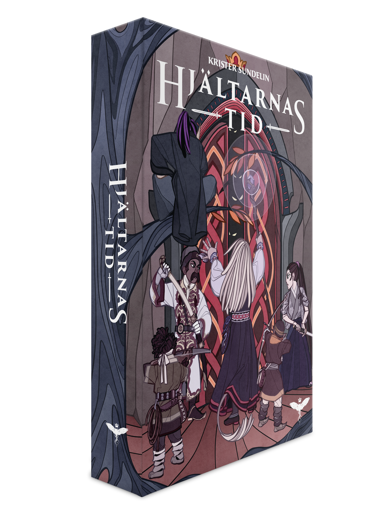
*   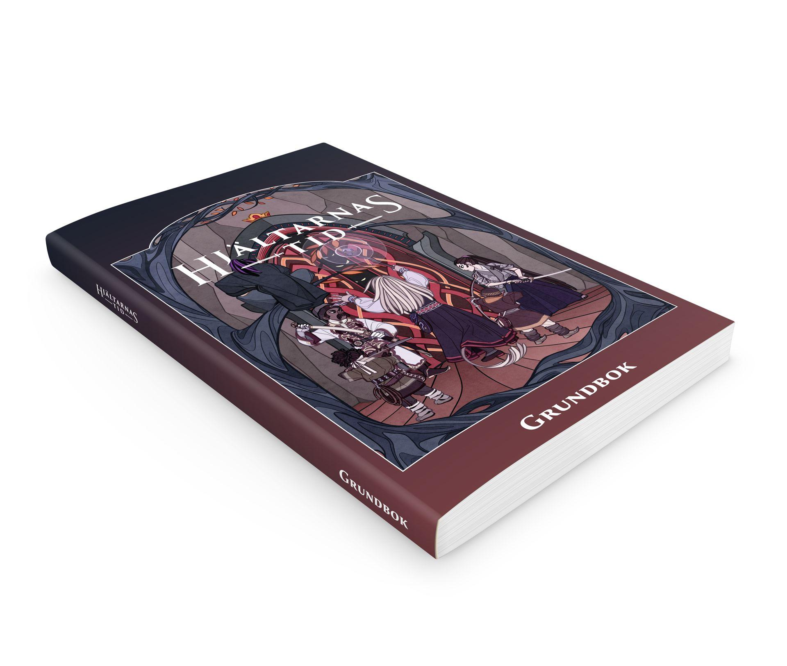
*   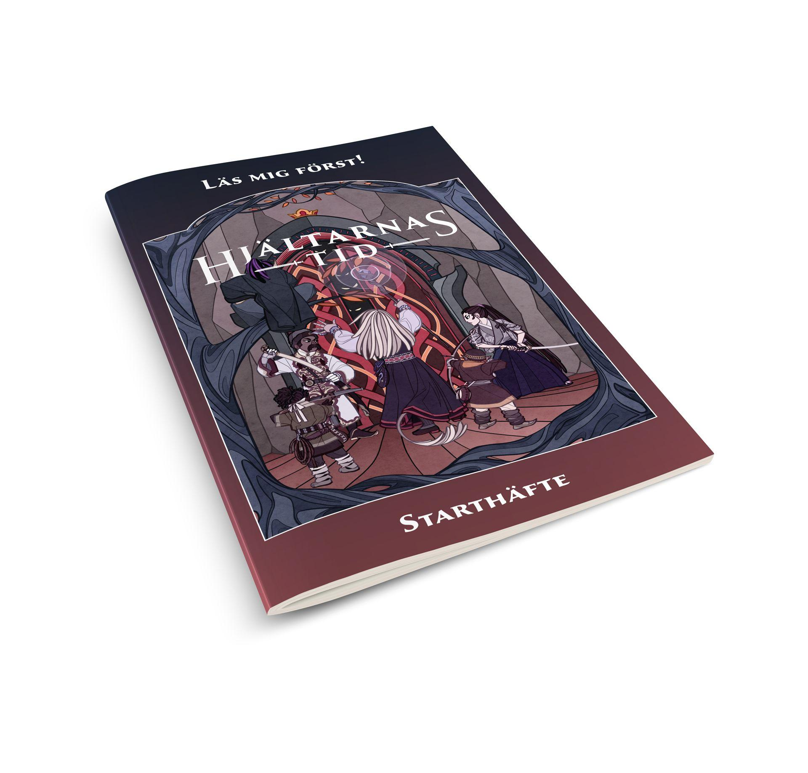
*   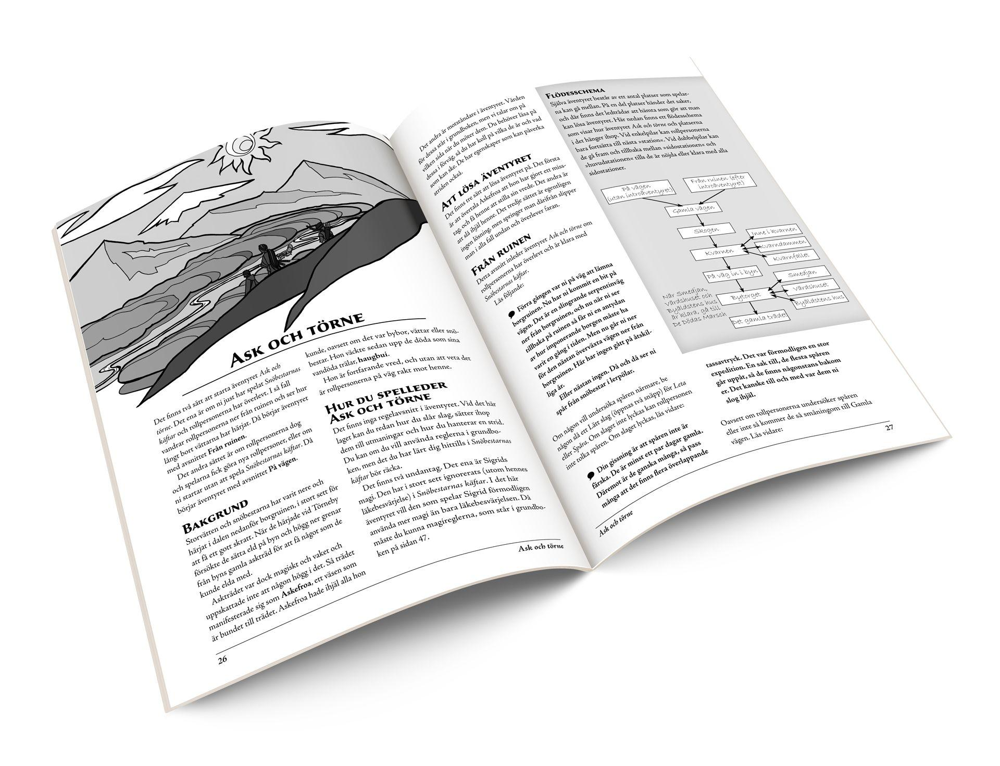
*   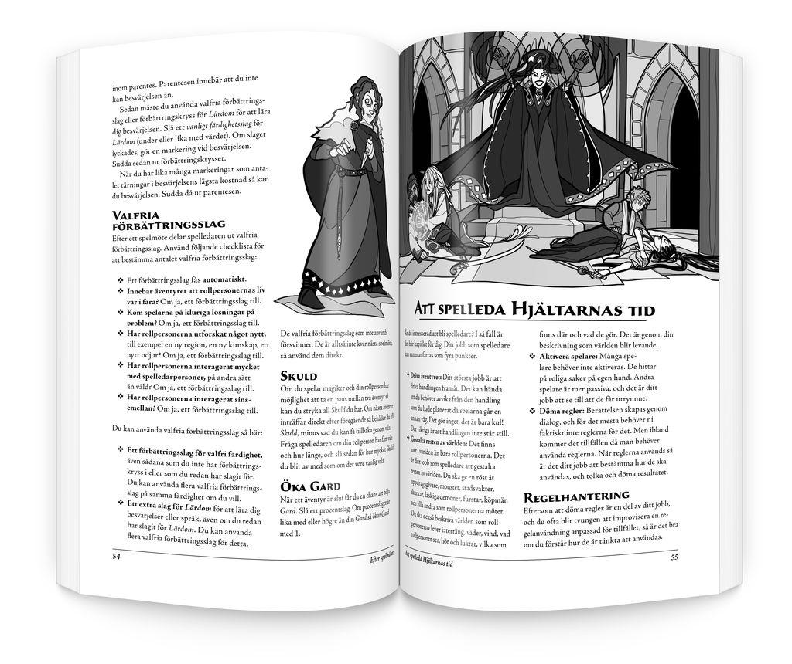
*   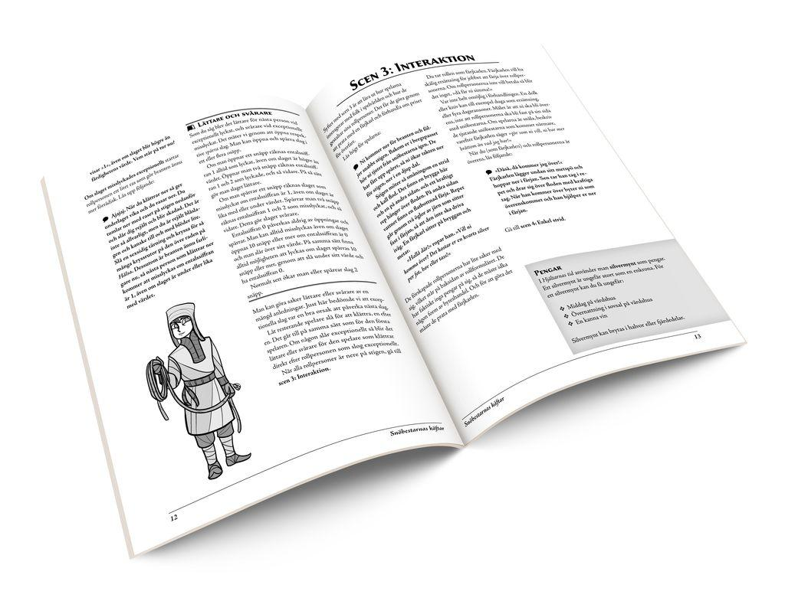
*   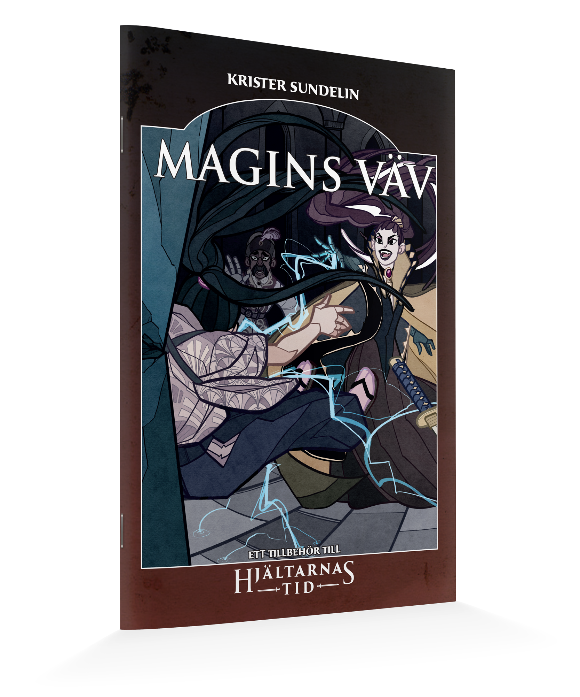
*   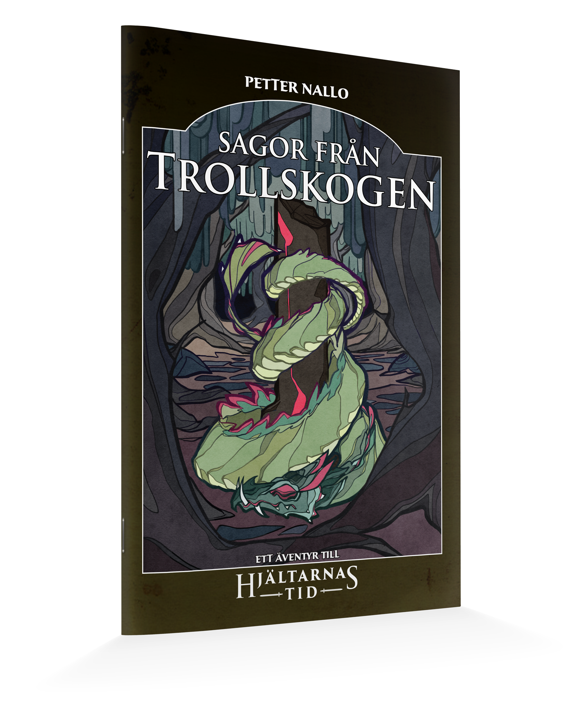
*   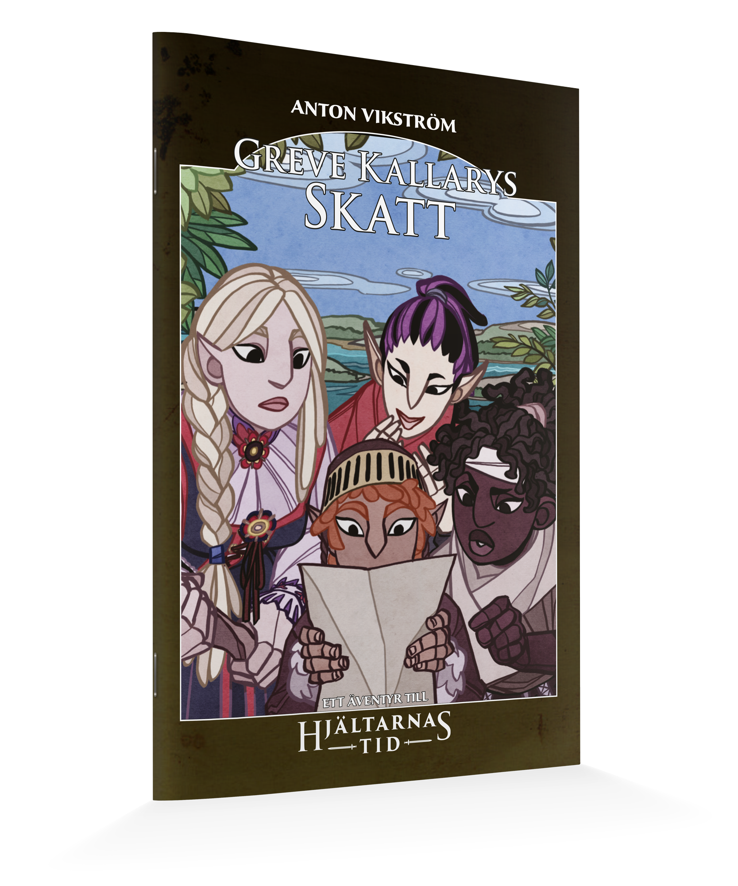
*   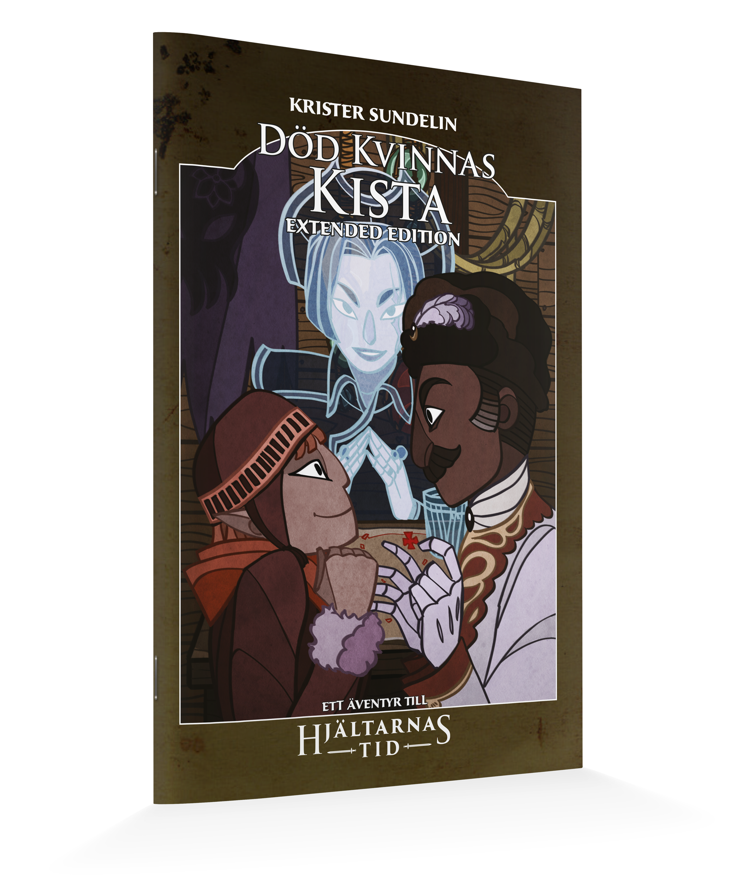
*   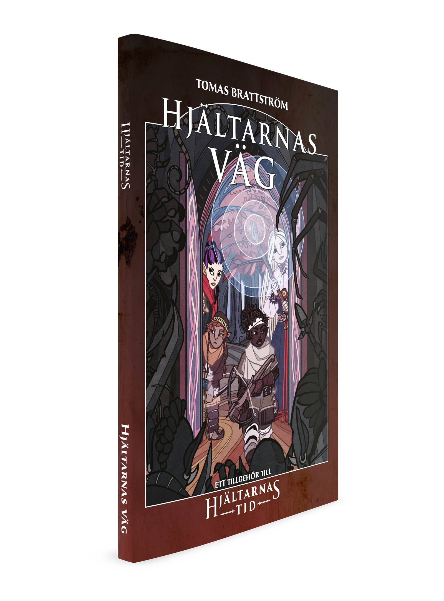
*   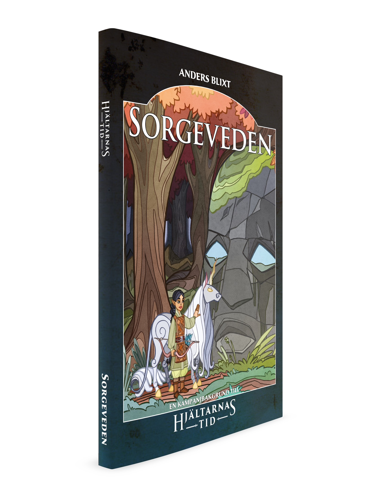